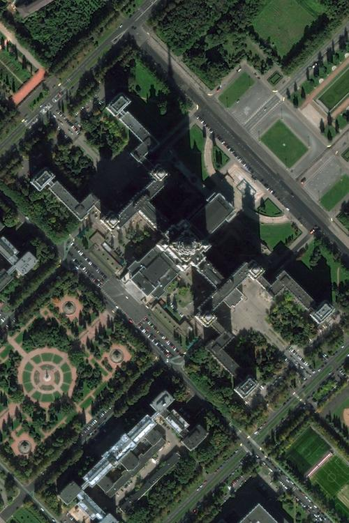
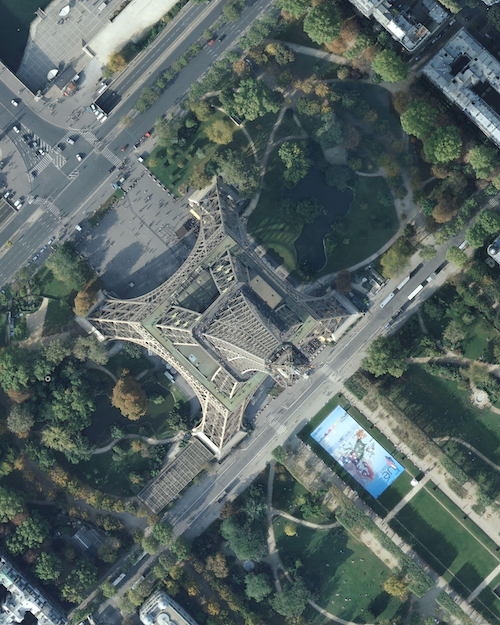

Google Maps Downloader
================================

*download maps from Google of any size by given coordinates and zoom level*

Recent changes
-------------------------
* fixed proxy issue
* new checkbox for proxy (disabling can cause 24 hour ban from Google, use at your own risk)

Functionality
-------------------------
* count the size of final map image
* download and merge map tiles in a given directory
* use public proxy to avoid ban of IP from Google
* GUI prints progress in built-in console

Known issues
-------------------------
* Program crashes when merging really big images (1500+ tiles)
* If program crashed or process is interrupted you will have to repeat downloading from beginning

Used external libraries
-------------------------
* JSoup for parsing proxy

-------------------------
Compilation from /src folder  
*nix:*
javac -cp ../lib/*:. MapsDownloader.java
*win:*
javac -cp ../lib/*;. MapsDownloader.java

Full sized example images can be found in /Example folder

